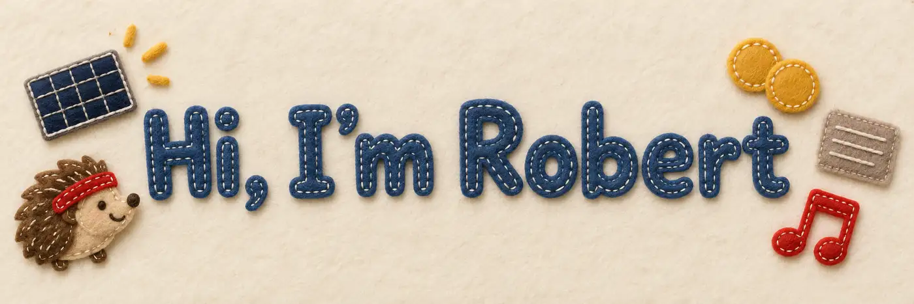

Senior full-stack engineer from Munich. Building for the web since 2008, with Ruby on Rails since 2011,
from features down to the infrastructure that runs them. Worker-owner at the
[Tech-Genossen eG](https://techgenossen.de), a tech cooperative.

Most of my work is closed source. From 2017 to 2024 I worked on [webgate.io](https://webgate.io), a video
review platform for film and TV: Rails and Vue.js features, a new transcoding infrastructure, a GlusterFS
storage cluster, and a better delivery process with feature staging, CI, code-quality tooling and regular
retrospectives. Before that gutefrage.net, where I mentored an apprentice and organised coding dojos and IT
drinkups, CHECK24 and YiGG. With the Tech-Genossen I relaunched [oekotest.de](https://www.oekotest.de) on Rails,
built [lunch-o-mat.com](https://lunch-o-mat.com) and a ton of smaller projects.

I like small teams, being close to the product and the people who use it, and boring, well-tested
software with few dependencies. In my spare time I build small self-hosted tools for our household –
and publish most of them.

## What I'm building

**🏠 Home & energy**

- [**ZiWoAS**](https://github.com/shostakovich/ziwoas) – energy dashboard for our flat: balcony solar,
  Shelly and Fritz!DECT plugs via MQTT, Govee lights over LAN. Rails, moving to Elixir/Phoenix.
- [**ziwoas-airquality**](https://github.com/shostakovich/ziwoas-airquality) – Sensirion SEN66 on an
  RP2040, Rust bridge to MQTT.
- [**hedgehog-fit**](https://github.com/shostakovich/hedgehog-fit) – TRMNL e-ink plugin: an 80s-fitness
  hedgehog nudges you into a one-minute exercise.

**💶 Money**

- [**Zipfelkasse**](https://github.com/shostakovich/zipfelkasse) – shared expenses for one household,
  inspired by Spliit. Crystal + SQLite, one binary, YNAB sync, and an MCP server so an AI can answer
  "what did we spend on groceries?".

**🌐 Web**

- [**felt-css**](https://github.com/shostakovich/felt-css) · [docs](https://felt-css.rocu.de/) –
  Bootstrap class names, two looks: clean, or every card cut from wool felt.
- [**Feather-Page CMS**](https://github.com/feather-page/cms) – manage small static websites that look
  hand-coded and load nothing external. Rails, moving to Phoenix.

**🤖 AI tooling**

- [**pi-container-vm**](https://github.com/shostakovich/pi-container-vm) – runs every tool of the pi
  coding agent inside a hardened Apple `container` VM; only the project directory is mounted.

My side projects are also my mad-scientist lab 🧑‍🔬 I'm fairly language-agnostic and like trying new ones –
hence Crystal, Rust and the Phoenix ports – and I experiment with how long a leash I can give coding agents.
I hold these projects to looser standards than client work; that's where the `claude/…` branches and the
occasional huge pull request come from.

## Over the years

Ten smaller projects, 2011–2021

| Year | Project | What it does |
|------|---------|--------------|
| 2021 | [zunzuncito](https://github.com/rocu-de/zunzuncito) | Featherlight CMS for static websites, the predecessor of Feather-Page |
| 2021 | [zaunkoenig](https://github.com/shostakovich/zaunkoenig) | Lightweight Jekyll theme |
| 2015 | [lunch-o-mat](https://github.com/shostakovich/lunch-o-mat) | Blind-date lunches between colleagues; grew into [lunch-o-mat.com](https://lunch-o-mat.com) at the Tech-Genossen |
| 2013 | [dotfiles](https://github.com/shostakovich/dotfiles) | My shell setup, 25 ⭐ |
| 2013 | [gitshots](https://github.com/shostakovich/gitshots) | Takes a webcam picture of me on every commit |
| 2013 | [cask-probe](https://github.com/shostakovich/cask-probe) | Checks whether Homebrew casks still install |
| 2012 | [Cruise-Pricesnapper](https://github.com/shostakovich/Cruise-Pricesnapper) | Samples cruise prices to find the best moment to book |
| 2011 | [Ethan](https://github.com/shostakovich/Ethan) | XMPP bot for Scrum teams, Node + CoffeeScript |
| 2011 | [Florette](https://github.com/shostakovich/Florette) | A small language that compiles to PHP |
| 2011 | [ZWeather](https://github.com/shostakovich/ZWeather) | Web frontend for our weather station |

**Contributions:** [32 merged pull requests](https://github.com/Homebrew/homebrew-cask/pulls?q=is%3Amerged+author%3Ashostakovich)
to Homebrew Cask in its early days (2013) · fixes for [redirector](https://github.com/vigetlabs/redirector)
and [castic](https://github.com/passcod/castic) · organised the
[OpenHack](https://github.com/OpenHack/openhack.github.com) nights in Munich (2013)

## Tools I reach for

Ruby on Rails · Hotwire · Elixir/Phoenix LiveView · PostgreSQL · SQLite · Crystal · Go · Rust ·
Docker · Ansible

## Elsewhere

- 🌍 [rocu.de](https://rocu.de/about-me/) – my site since 2001
- 🎼 The username is a nod to Dmitri Shostakovich.

Most of these repos are built for our household, so I keep their scope tight and don't take pull
requests. Issues and forks are very welcome.
